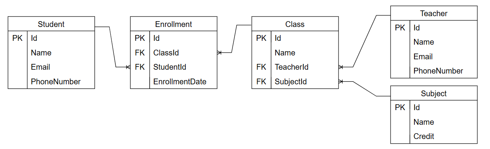

# School System Test

This is a .NET 8.0 project using ASP.NET Core with support for JWT Authentication, OpenAPI, and Entity Framework Core.

This Project used for technical test in PT. Neural Technologies Indonesia

## Table of Contents

- [School System Test](#school-system-test)
  - [Table of Contents](#table-of-contents)
  - [Assumptions](#assumptions)
  - [Prerequisites](#prerequisites)
  - [Installation](#installation)
  - [Configuration](#configuration)
  - [Running the Application](#running-the-application)
  - [Testing](#testing)

---
## Assumptions

1. The database schema is modeled as follows (Entity-Relationship Diagram):

   

---

## Prerequisites

Ensure you have the following installed:

1. **.NET SDK**  
   Download and install the .NET 8.0 SDK from [Microsoft's official website](https://dotnet.microsoft.com/download/dotnet/8.0).

2. **Database**  
   This project uses PostgreSQL. Ensure you have a PostgreSQL database installed and running.

3. **Optional Tools**  
   - **Visual Studio** or **Visual Studio Code** for development.

---

## Installation

1. Clone the repository:
   ```bash
   git clone https://github.com/feril68/school-system-test
   cd school-system-test
   ```

2. Restore the required NuGet packages:
   ```bash
   dotnet restore
   ```

3. Build the project:
   ```bash
   dotnet build
   ```

---

## Configuration

1. **Environment Variables**  
   Create a `.env` file in the root of the project. Populate it with necessary environment variables, such as database connection strings and JWT settings.

   Example `.env` file:
   ```
   ConnectionStrings__DefaultConnection=Host=localhost;Database=school_system;Username=postgres;Password=test123
   Jwt__Key=83CF2BE5E22EE899463158DDA559FDw2
   Jwt__Issuer=SchoolSystem
   Jwt__Audience=SchoolSystemUsers
   ```

   The project uses the `DotNetEnv` package to load environment variables.

2. **Database Migration**  
   Apply Entity Framework migrations to set up the database schema:
   ```bash
   dotnet ef database update
   ```

---

## Running the Application

1. Start the application in development mode:
   ```bash
   dotnet run
   ```

   The API will be accessible at `http://localhost:5089`.

2. Access the Swagger UI for API documentation:
   Navigate to `http://localhost:5089/swagger` in your browser.

---

## Testing

This project uses `xUnit` and `Moq` for testing. To run the tests:

1. Execute the following command:
   ```bash
   dotnet test
   ```

2. Ensure all tests pass before deploying or making further changes.

